<!--
  VECTORA — SEMANTIC VECTOR ENGINEERING SYSTEM

  Product language:
  Carbon #080A0D · Vector Cyan #19D3C5 · Signal Violet #8B6BFF · Ink #F4F1EB

  Operating doctrine:
  Pixels are output. Structure is the product.
  Every node has identity. Every mutation has history.
  Every generated document crosses a validation boundary.

  Every diagram in this file is generated from source:
  scripts/readme-assets/*.mjs → assets/readme/*.svg (npm run assets:generate)
  and verified by npm run assets:verify.
-->

<div align="center">


# VECTORA

**SEMANTIC VECTOR ENGINEERING SYSTEM** — prompt · construct · edit · animate · export

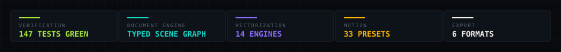

**VECTORA turns intent into editable vector structure** — not a flattened image, not a disposable generation, and not a canvas full of anonymous paths.

[Document Engine](#01--the-document-engine) ·
[AI Synthesis](#03--ai-vector-synthesis) ·
[Vectorization Lab](#04--the-vectorization-lab) ·
[Animation](#05--the-animation-bay) ·
[Security](#06--the-security-rail) ·
[Exports](#07--the-export-bay) ·
[Verification](#08--the-verification-floor) ·
[Deployment](#09--deployment) ·
[Operations](#10--operations)

</div>

---

## 00 / SYSTEM IDENTITY

VECTORA is a generative SVG studio and a semantic vector-engineering environment built on one idea:

> **The core product is not the canvas. The core product is a typed, persistent, reversible vector document.**

AI synthesis, direct visual editing, code-level control, client-side raster vectorization, animation and software-oriented export all operate on that single document. SVG is what flows in and out — the document is what you actually work on.

| Doctrine | Meaning |
|---|---|
| **Pixels are output** | every surface ends in exportable structure, never in a baked bitmap |
| **Structure is the product** | layers, semantics and relationships survive every operation |
| **Every node has identity** | stable uids make elements addressable by canvas, code and AI alike |
| **Every mutation has history** | transactions with precise inverses — undo anything, from anywhere |
| **Everything generated crosses a gate** | no SVG renders without passing the security rail |

---

## 01 / THE DOCUMENT ENGINE

The canonical engine is a typed scene graph — plain JSON that can be cloned, diffed, persisted and migrated without a DOM. Stable internal uids survive renames, id edits and re-imports; `inkscape:` and `sodipodi:` namespace metadata round-trips untouched.

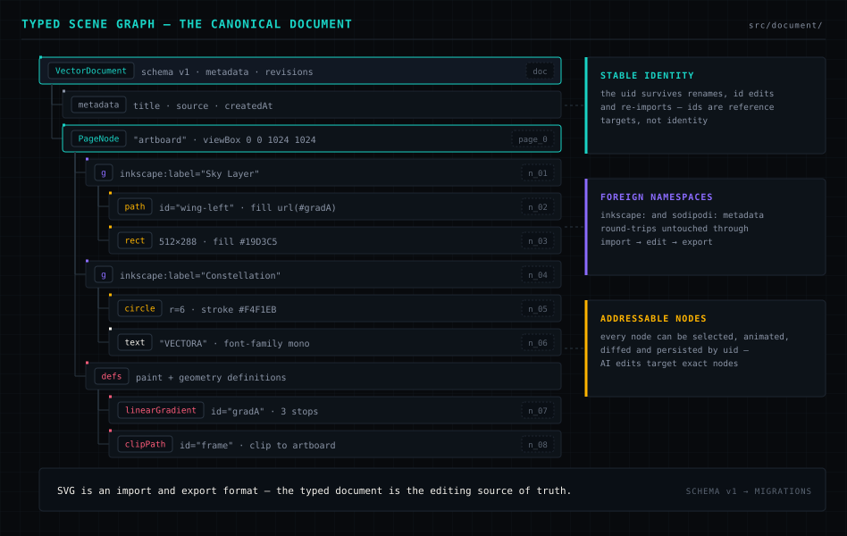

```ts
interface ElementNode {
  type: 'element';
  uid: string;                    // stable identity — survives renames & re-imports
  kind: string;                   // 'g' | 'path' | 'rect' | 'circle' | 'text' | ...
  ns?: string;                    // non-SVG namespace (Inkscape metadata round-trips)
  attrs: Record<string, string>;  // SVG attributes by qualified name
  children: VectorNode[];
}
```

Every editing surface — canvas, layer rack, code editor, AI route, import adapter, plugins — derives from the graph and writes back through commands. No surface holds a private copy of the artwork.

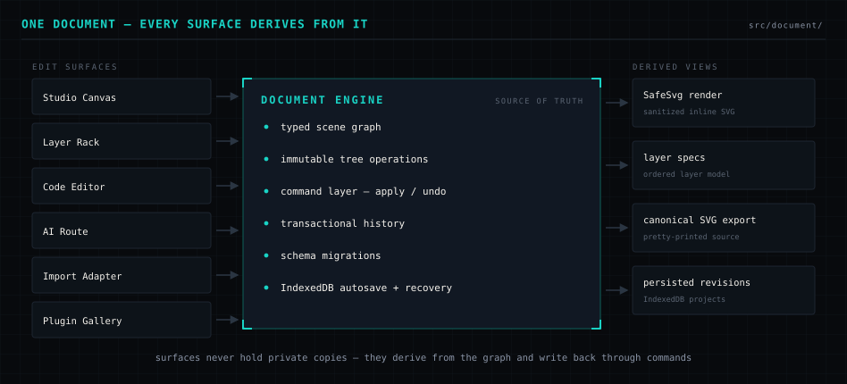

| Property | Implementation |
|---|---|
| Source of truth | `src/document/` — typed nodes, immutable path-copying tree ops |
| Identity | stable `uid` per node; element `id`s are reference targets, not identity |
| Persistence | IndexedDB projects, debounced autosave, crash recovery on reload |
| Evolution | schema version + migration chain — saved work upgrades in place |
| Import / export | semantic SVG adapters with uid reuse and whitespace fidelity |

---

## 02 / COMMAND HISTORY & UNDO/REDO

Every meaningful edit enters the document as a command with a precise inverse. Multi-command actions fold into single transactions; rapid keystrokes coalesce into one entry. Undo works identically whether the change came from a click, a keystroke, an import or an AI operation.

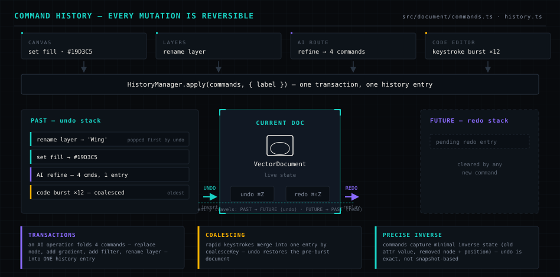

```ts
interface EditorCommand {
  readonly type: string;
  readonly label: string;
  readonly affectedNodeIds: string[];
  apply(doc: VectorDocument): VectorDocument;
  undo(doc: VectorDocument): VectorDocument;  // minimal captured inverse — not a snapshot
}
```

---

## 03 / AI VECTOR SYNTHESIS

Gemini is orchestrated server-side as a vector-generation and transformation engine: a model pool with fail-forward rotation, a sanitized-JSON repair layer, a runtime response contract, and the same dual SVG gate every other document crosses. An AI result is just another editable, undoable transaction on the graph.

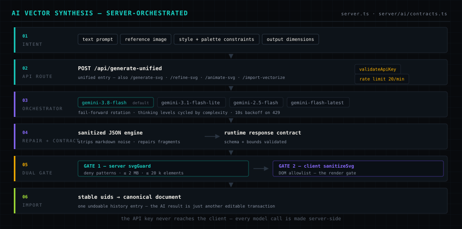

**Model pool** — `gemini-3.8-flash` (default) → `gemini-3.1-flash-lite` → `gemini-2.5-flash` → `gemini-flash-latest`, with thinking levels cycled by complexity and 10s backoff on resource exhaustion.

| Endpoint | Purpose |
|---|---|
| `POST /api/generate-unified` | unified text · vision · document generation |
| `POST /api/generate-svg` | text-to-vector synthesis |
| `POST /api/refine-svg` | natural-language structural refinement |
| `POST /api/animate-svg` | kinetic binding payloads |
| `POST /api/import-vectorize` | server-side import assistance |
| `GET /api/health` · `/api/diagnostics/models` | liveness + model pool status |

The API key never reaches the client — the studio runs fully without it and reports the AI engine as offline until it is configured.

---

## 04 / THE VECTORIZATION LAB

Fourteen client-side tracing engines turn raster input into different *interpretations* — creative processors, not one generic “trace image” button. Zero external dependencies, zero network calls: the pixel pipeline never leaves the browser.

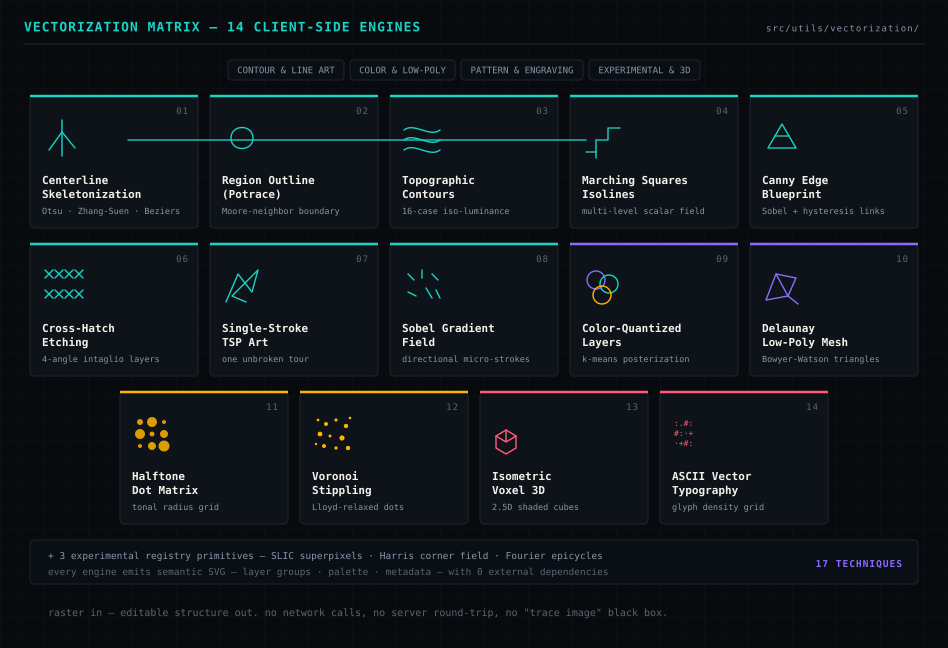

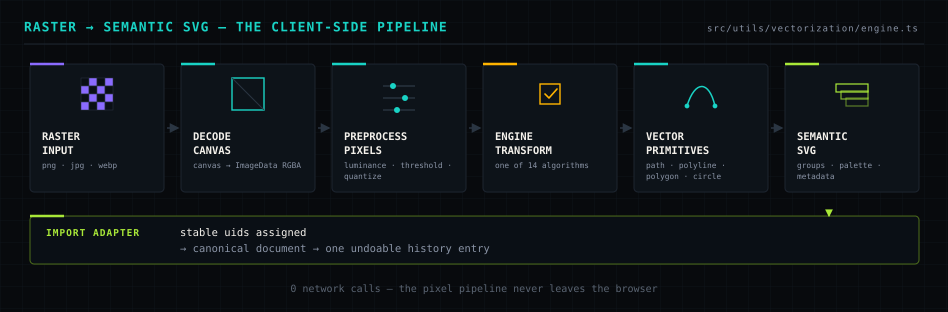

---

## 05 / THE ANIMATION BAY

A kinetic engine binds motion to document structure — CSS keyframes, SMIL and timeline synchronization generated from the live scene graph, exportable as GIF and sprite sheets.

| Family | Presets |
|---|---|
| **Reveal & Draw** | pen draw-on · typewriter glyphs · directional wipe · signature ink bleed · iris aperture |
| **Morph & Transform** | harmonic path morph · skeleton rig · Perlin path warp · elastic bounce |
| **Particle & Emission** | particle trail · constellation assembly · firefly ambience |
| **Color & Gradient** | liquid gradient flow · 360° hue shift · chromatic RGB glitch |
| **Kinetic & Physics** | follow-path motion · wave distortion · pendulum swing · domino cascade |
| **Advanced Cinematic** | parallax depth · camera dolly · lightning strike · puzzle assembly · liquid fill |

Plus 9 modern production adapters — scroll-driven draw, intersection stagger, spring physics, GSAP timeline, variable fonts, view transitions, Lottie export pipeline and more.

---

## 06 / THE SECURITY RAIL

Generated and imported SVG is treated as untrusted input until it is proven otherwise. Two independent gates stand between every source — AI output, file import, session history, showcase samples — and the renderer.

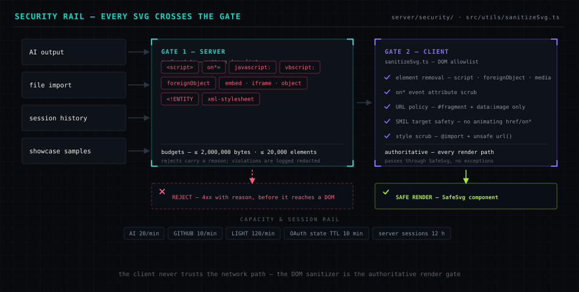

| Layer | Mechanism |
|---|---|
| **Server — `svgGuard`** | pattern deny-list: `<script>`, `on*=` handlers, `javascript:`/`vbscript:` URLs, `foreignObject`, `embed`/`iframe`/`object`, `<!ENTITY`, `xml-stylesheet` |
| **Budgets** | ≤ 2,000,000 bytes · ≤ 20,000 elements per document — rejected with a reason |
| **Client — `sanitizeSvg`** | DOM allowlist: element removal, `on*` scrub, fragment/`data:image`-only URL policy, SMIL target safety, style scrub |
| **Render** | `SafeSvg` is the only sanctioned inline-SVG path — no exceptions |
| **Capacity** | rate limits (AI 20/min · GitHub 10/min · light 120/min) · OAuth state TTL 10 min · server sessions 12 h |

The client never trusts the network path — the DOM sanitizer is the authoritative render gate.

---

## 07 / THE EXPORT BAY

One document, six delivery surfaces. Every export derives from the typed graph — never from a screenshot.

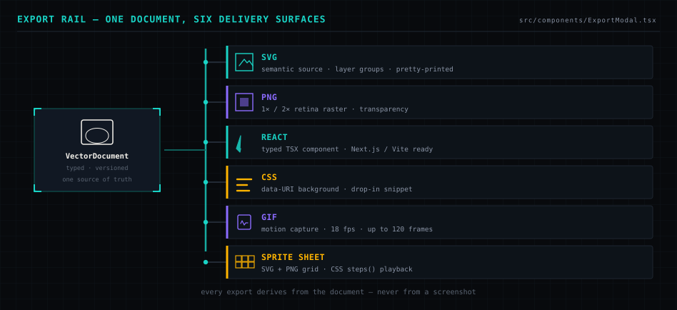

| Format | Delivers |
|---|---|
| **SVG** | semantic source with layer groups, pretty-printed |
| **PNG** | 1× / 2× retina raster with transparency |
| **React** | typed TSX component for Next.js / Vite codebases |
| **CSS** | data-URI background snippet |
| **GIF** | motion capture at 18 fps, up to 120 frames |
| **Sprite sheet** | SVG + PNG frame grid with a CSS `steps()` playback snippet |

---

## 08 / THE VERIFICATION FLOOR

The suite covers the engine, the gates and the pipeline — **147 tests across 15 files**, all green, plus typecheck and a full production build.


```bash
npm test      # 147 tests · 15 files — engine 66 · sanitizer+parser 31 · security 30 · server+AI 20
npm run lint  # tsc --noEmit — 0 errors
npm run build # vite client bundle + esbuild server.cjs
```

---

## 09 / DEPLOYMENT

One process, three planes. A single Node/Express server hosts the API, serves the built client in production, and holds the only credentials in the system.

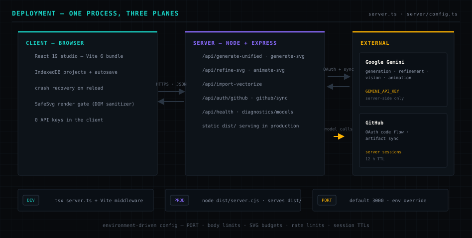

| Variable | Purpose | Default |
|---|---|---|
| `GEMINI_API_KEY` | Gemini access for AI routes (server-side only) | — |
| `PORT` | HTTP port the server binds | `3000` |
| `APP_URL` | hosted URL for OAuth callbacks | — |
| `GITHUB_CLIENT_ID` / `GITHUB_CLIENT_SECRET` | GitHub OAuth for the commit dock | — |
| `MAX_SVG_BYTES` / `MAX_SVG_ELEMENTS` | SVG complexity budgets | `2000000` / `20000` |
| `RATE_LIMIT_AI_*` / `_GITHUB_*` / `_LIGHT_*` | per-group request budgets | `20` / `10` / `120` per min |
| `OAUTH_STATE_TTL_MS` / `SESSION_TTL_MS` | token lifetimes | `600000` / `43200000` |

---

## 10 / OPERATIONS

### Local ignition

```bash
npm install
cp .env.example .env      # add GEMINI_API_KEY to arm the AI routes — the studio runs without it
npm run dev               # tsx server.ts + Vite middleware → http://localhost:3000

npm test                  # 147 tests
npm run lint              # typecheck
npm run build && npm start # production: serves dist/ from dist/server.cjs
```

### README asset pipeline

Every diagram in this file is code — generated deterministically, and guarded by a verification gate that fails on any broken path, malformed XML or non-Camo-safe construct:

```bash
npm run assets:generate   # regenerate assets/readme/*.svg from scripts/readme-assets/
npm run assets:verify     # validate XML, Camo-safety, responsive sizing, path + anchor integrity
```

### Repository map

```text
server.ts                 API routes + Gemini orchestrator
server/                   config · AI contracts · security (svgGuard, rateLimit, sessions, oauthState)
src/document/             canonical engine — types · tree · commands · history · importer · exporter · persistence · migrations
src/utils/vectorization/  14 tracing engines + experimental primitives
src/utils/animations/     24 kinetic presets + 9 production adapters
src/utils/sanitizeSvg.ts  authoritative DOM sanitizer
src/components/           studio surfaces — canvas, layers, code editor, import, timeline, export
assets/readme/            generated README diagrams (13 SVGs)
scripts/                  asset generation + verification
docs/                     architecture reports, audit and file tree
```

Deep dives: [`ARCHITECTURE_REPORT`](docs/ARCHITECTURE_REPORT.md) · [`AUDIT`](docs/AUDIT.md) · [`APP_REPORT`](docs/APP_REPORT.md) · [`FILE_TREE`](docs/FILE_TREE.md)

---

<div align="center">

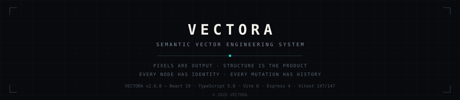

</div>
