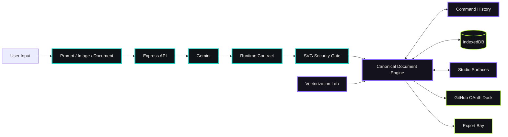

<!--
  VECTORA
  SEMANTIC VECTOR ENGINEERING SYSTEM

  Product language:
  Carbon #080A0D · Vector Cyan #19D3C5 · Signal Violet #8B6BFF · Ink #F4F1EB

  Operating doctrine:
  Pixels are output.
  Structure is the product.
  Every node has identity.
  Every mutation has history.
  Every generated document crosses a validation boundary.
-->

<div align="center">

# VECTORA

### SEMANTIC VECTOR ENGINEERING SYSTEM  
### PROMPT · CONSTRUCT · EDIT · ANIMATE · EXPORT

<br>

[](#the-document-engine)
[](#verification-floor)
[](#vectorization-lab)
[](https://www.typescriptlang.org)
[](https://react.dev)
[](#export-bay)

<br>

> **VECTORA turns intent into editable vector structure — not a flattened image, not a disposable generation, and not a canvas full of anonymous paths.**

[Document Engine](#the-document-engine) ·
[AI Synthesis](#ai-vector-synthesis) ·
[Vectorization Lab](#vectorization-lab) ·
[Animation](#animation-bay) ·
[Exports](#export-bay) ·
[Security](#security-rail) ·
[Quick Start](#local-ignition)

</div>

---

# `00 / SYSTEM IDENTITY`

VECTORA is a generative SVG studio and semantic vector-engineering environment.

It combines AI-assisted creation, direct visual editing, code-level control, client-side image vectorization, animation and software-oriented export inside one document system.

The core product is not the canvas.

The core product is a typed, persistent and reversible vector document.

```text
INTENT
  │
  ├── text prompt
  ├── reference image
  ├── uploaded document
  ├── imported SVG
  └── direct editing
          │
          ▼
CANONICAL VECTOR DOCUMENT
          │
          ├── stable node identities
          ├── typed properties
          ├── ordered layers
          ├── immutable mutations
          ├── transactional history
          └── persistent revisions
          │
          ▼
VISUAL + CODE SURFACES
          │
          ▼
SVG · PNG · REACT · CSS · GIF · SPRITE SHEET
```

VECTORA treats SVG as a software artifact:

- structured;
- inspectable;
- editable;
- versionable;
- scriptable;
- exportable;
- reusable in production interfaces.

---

# `01 / THE VECTOR PROBLEM`

Most generative image systems finish at pixels.

Pixels are useful for display, but they discard the structure required for engineering and design-system work.

A flattened generation does not preserve:

- layer identity;
- semantic grouping;
- path purpose;
- editable colors;
- reusable geometry;
- element relationships;
- component boundaries;
- animation targets;
- source-level control;
- reliable undo and redo.

Traditional SVG editors preserve structure, but they are rarely designed around AI generation, programmatic output and software delivery.

VECTORA connects both worlds.

```text
GENERATION WITHOUT STRUCTURE        STRUCTURE WITHOUT GENERATION
             │                                   │
             └────────────────┬──────────────────┘
                              ▼
                       VECTORA DOCUMENT
                              │
            AI synthesis + engineering control
```

---

# `02 / OPERATING FLOOR`

VECTORA is organized as a connected set of vector-production stations.

| Station | Responsibility |
|---|---|
| **Prompt Console** | Converts text, image and document input into a vector-generation request |
| **Document Engine** | Maintains the canonical typed scene graph |
| **Studio Canvas** | Renders and navigates the active vector document |
| **Layer Rack** | Controls order, visibility, locking, naming and blending |
| **Code Chamber** | Exposes editable SVG source synchronized with the document |
| **Vectorization Lab** | Runs 14 client-side raster-to-vector transformations |
| **Palette System** | Extracts, applies and manages reusable color systems |
| **Animation Bay** | Creates motion definitions and exportable animation output |
| **Plugin Gallery** | Mounts reusable creative operations |
| **Persistence Rail** | Saves projects and restores interrupted sessions |
| **GitHub Dock** | Commits vector artifacts through a protected OAuth flow |
| **Export Bay** | Produces SVG, PNG, React, CSS, GIF and sprite-sheet outputs |

These stations operate on one document model rather than maintaining disconnected copies of the artwork.

---

# `03 / THE DOCUMENT ENGINE`

The canonical document engine is the central piece of VECTORA.

SVG is an import and export format. It is not the only source of truth while the user is editing.

The active project is represented as a typed scene graph.

```text
VectorDocument
├── metadata
├── viewport
├── definitions
├── root
│   ├── group
│   │   ├── path
│   │   ├── shape
│   │   └── text
│   ├── image
│   └── component group
├── palettes
├── animation tracks
└── revision metadata
```

## Stable node identity

Every editable node carries an identity that remains stable across operations.

Stable IDs make it possible to:

- select elements reliably;
- preserve layer references;
- attach animation tracks;
- replay commands;
- compare revisions;
- update one node without replacing the document;
- reconnect imported and exported structures.

```typescript
type VectorNodeId = string;

interface VectorNodeBase {
  id: VectorNodeId;
  type: VectorNodeType;
  name: string;
  visible: boolean;
  locked: boolean;
  opacity: number;
  blendMode?: string;
  metadata?: Record<string, unknown>;
}
```

## Typed nodes

The engine distinguishes between vector concepts instead of storing every element as an untyped string.

Representative nodes include:

- document root;
- group;
- path;
- rectangle;
- circle;
- ellipse;
- line;
- polygon;
- text;
- image;
- definition;
- gradient;
- mask;
- clip path.

Typed nodes make validation and controlled mutation possible.

## Immutable mutation

Editing operations produce a new document state rather than mutating arbitrary objects across the interface.

```text
CURRENT DOCUMENT
       │
       ▼
VALIDATED COMMAND
       │
       ▼
IMMUTABLE TRANSFORM
       │
       ▼
NEXT DOCUMENT
       │
       ├── render
       ├── persist
       └── record history
```

This reduces hidden state drift between:

- canvas;
- layer panel;
- code editor;
- AI operations;
- imports;
- plugin actions.

## Document migrations

Persisted projects can evolve with the engine.

Migration support allows the document schema to change without abandoning saved user work.

```text
stored document v1
        │
        ▼
migration v1 → v2
        │
        ▼
migration v2 → v3
        │
        ▼
current document contract
```

---

# `04 / TRANSACTIONAL COMMAND SYSTEM`

Every meaningful edit enters the document through a command.

A command describes:

- intent;
- target;
- validated payload;
- forward operation;
- inverse operation;
- history label;
- transaction boundary.

```typescript
interface DocumentCommand {
  id: string;
  label: string;
  execute(document: VectorDocument): VectorDocument;
  invert(before: VectorDocument): DocumentCommand;
}
```

## Command examples

- Add node
- Remove node
- Rename layer
- Reorder layer
- Toggle visibility
- Toggle lock
- Change fill
- Change stroke
- Change opacity
- Apply blend mode
- Replace path data
- Group nodes
- Ungroup nodes
- Apply generated operation
- Import SVG
- Apply palette
- Add animation track

## Transactional history

Complex actions can contain several low-level mutations while appearing as one reversible user action.

```text
AI OPERATION: "Convert title to outlined neon lettering"
       │
       ├── replace text node
       ├── create outline path
       ├── add gradient definition
       ├── add glow filter
       └── update layer name
               │
               ▼
        ONE HISTORY ENTRY
```

Undo and redo operate across mutation sources.

The history engine does not care whether the change came from:

- the canvas;
- the layer panel;
- the code editor;
- a palette action;
- an AI command;
- an import adapter;
- a plugin.

That consistency is the difference between a collection of editing widgets and a real editor.

---

# `05 / AI VECTOR SYNTHESIS`

VECTORA uses Gemini as a vector-generation and transformation engine.

The AI layer can accept:

- natural-language prompts;
- visual references;
- uploaded documents;
- existing SVG context;
- palette requirements;
- style constraints;
- composition instructions;
- output dimensions.

```text
USER INTENT
    │
    ▼
PROMPT CONTRACT
    │
    ├── requested style
    ├── composition
    ├── palette
    ├── dimensions
    ├── layer expectations
    └── complexity budget
    │
    ▼
SERVER-SIDE AI ROUTE
    │
    ▼
RUNTIME RESPONSE CONTRACT
    │
    ▼
SVG SECURITY + COMPLEXITY GATE
    │
    ▼
DOCUMENT IMPORT ADAPTER
    │
    ▼
CANONICAL SCENE GRAPH
```

## Text-to-vector

A text prompt can describe:

- icon systems;
- illustrations;
- interface graphics;
- diagrams;
- posters;
- logos;
- geometric compositions;
- abstract art;
- data-oriented visuals;
- animation-ready scenes.

The generated result is imported into the document engine, where it becomes editable structure.

## Image-assisted synthesis

Reference images can inform:

- composition;
- silhouette;
- palette;
- visual rhythm;
- layout;
- shape language;
- contrast.

The system does not need to preserve a reference as a permanent opaque image. It can use the reference to construct vector-native output.

## Document-assisted synthesis

Uploaded material can provide:

- brand rules;
- product requirements;
- color definitions;
- textual content;
- diagram structure;
- visual constraints.

This supports workflows where vector output must follow a wider product context.

## AI editing direction

The AI layer is structured to operate as a document-aware assistant.

Instead of treating every change as “generate a completely new SVG,” the engineering direction supports validated operation plans:

```json
{
  "operations": [
    {
      "type": "update-fill",
      "targetId": "node-title",
      "value": "#19D3C5"
    },
    {
      "type": "set-opacity",
      "targetId": "node-grid",
      "value": 0.35
    }
  ]
}
```

This preserves document identity, history and user control.

---

# `06 / STUDIO CANVAS`

The Studio Canvas is the visual operating surface of the document engine.

It supports:

- pan;
- zoom;
- artboard framing;
- document preview;
- node-aware rendering;
- safe SVG display;
- layer synchronization;
- code synchronization;
- persistence updates.

## Canvas pipeline

```text
VECTOR DOCUMENT
      │
      ▼
DOCUMENT-TO-SVG ADAPTER
      │
      ▼
SANITIZATION
      │
      ▼
SAFE SVG COMPONENT
      │
      ▼
STUDIO CANVAS
```

The canvas never needs to trust unvalidated AI output directly.

## Navigation

Pan and zoom are treated as viewport state rather than destructive changes to artwork geometry.

This keeps document coordinates stable while the user changes the viewing position.

## Artboard system

The artboard carries:

- viewport dimensions;
- aspect ratio;
- background behavior;
- export region;
- display scale.

Projects can target formats such as:

- square icons;
- interface illustrations;
- posters;
- banners;
- landscape scenes;
- portrait compositions;
- custom software assets.

---

# `07 / LAYER RACK`

The Layer Rack exposes the vector document as an ordered production stack.

Each layer can support:

- name;
- type;
- nesting depth;
- visibility;
- lock state;
- opacity;
- blend mode;
- child count;
- selection state.

## Layer operations

```text
SHOW / HIDE
LOCK / UNLOCK
RENAME
REORDER
GROUP
UNGROUP
DUPLICATE
DELETE
CHANGE OPACITY
CHANGE BLEND MODE
```

Layer operations enter the same command history used by the rest of the studio.

## Reordering

Reordering a layer changes the canonical node order.

It does not merely rearrange a visual list while leaving the exported SVG unchanged.

```text
LAYER DRAG
    │
    ▼
REORDER COMMAND
    │
    ▼
SCENE GRAPH UPDATE
    │
    ├── canvas rerender
    ├── code refresh
    ├── persistence update
    └── history entry
```

---

# `08 / BIDIRECTIONAL CODE CHAMBER`

VECTORA exposes SVG source as an engineering surface.

The user can inspect the generated markup instead of being locked behind a purely visual abstraction.

The code path supports two directions:

```text
DOCUMENT ─────────────► SVG SOURCE
DOCUMENT ◄───────────── EDITED SVG
```

## Document to code

The current scene graph is serialized into:

- semantic SVG elements;
- stable IDs;
- ordered groups;
- definitions;
- gradients;
- masks;
- filters;
- animation structures.

## Code to document

When source is edited, the system can:

1. parse the SVG;
2. sanitize unsafe structures;
3. validate complexity;
4. normalize attributes;
5. rebuild typed nodes;
6. preserve or regenerate stable IDs;
7. replace the document through a history transaction.

The code editor is therefore part of the document system, not an isolated preview box.

---

# `09 / VECTOR IMPORT PIPELINE`

Imported SVG files cross a controlled adapter before entering the editor.

```text
SVG INPUT
   │
   ▼
XML / SVG PARSE
   │
   ▼
SECURITY SANITIZATION
   │
   ▼
ATTRIBUTE NORMALIZATION
   │
   ▼
NODE TYPE MAPPING
   │
   ▼
STABLE ID ASSIGNMENT
   │
   ▼
CANONICAL DOCUMENT
```

The import layer handles the translation between external SVG structure and VECTORA’s internal document model.

This allows externally created vectors to participate in:

- layer editing;
- history;
- persistence;
- palette changes;
- animation;
- code synchronization;
- export.

---

# `10 / VECTORIZATION LAB`

VECTORA contains 14 client-side vectorization engines.

These engines turn raster input into different forms of vector interpretation.

They are creative processors, not one generic “trace image” button.

## Engine families

### Centerline tracing

Extracts line-oriented structure useful for:

- sketches;
- handwritten forms;
- technical line work;
- engraving-style output.

### Color quantization

Reduces raster color complexity and constructs vector regions from the resulting palette.

Useful for:

- posterization;
- flat illustrations;
- simplified brand assets;
- limited-color graphics.

### Delaunay geometry

Converts image information into triangulated compositions.

Useful for:

- low-poly artwork;
- geometric portraits;
- abstract backgrounds;
- faceted visual systems.

### Voronoi stippling

Uses distributed cells or points to approximate tone and structure.

Useful for:

- stippled portraits;
- scientific illustration styles;
- print-oriented textures;
- generative compositions.

### Halftone

Transforms luminance into repeatable vector patterns.

Useful for:

- editorial graphics;
- retro print effects;
- comic textures;
- scalable screen patterns.

### Canny-style blueprint extraction

Emphasizes edge information and structural contours.

Useful for:

- blueprint aesthetics;
- technical visualization;
- interface backdrops;
- mechanical illustration.

### Additional processors

The lab also supports related transformations for:

- contour interpretation;
- threshold-based tracing;
- palette mapping;
- pattern generation;
- geometric abstraction;
- artistic edge processing;
- shape-field construction;
- density-driven output.

## Vectorization pipeline

```text
RASTER INPUT
    │
    ▼
PIXEL ANALYSIS
    │
    ▼
ENGINE-SPECIFIC TRANSFORM
    │
    ▼
VECTOR PRIMITIVES
    │
    ▼
GROUP + LAYER CONSTRUCTION
    │
    ▼
CANONICAL DOCUMENT IMPORT
```

Because processing occurs client-side, experimentation can remain responsive and does not require uploading every intermediate raster transformation to a remote service.

---

# `11 / PALETTE SYSTEM`

Color is handled as reusable product data.

A palette can be:

- extracted from an image;
- generated from a prompt;
- selected from a preset;
- edited manually;
- applied to selected nodes;
- applied across a complete document;
- stored with the project.

```typescript
interface VectorPalette {
  id: string;
  name: string;
  colors: string[];
  source?: "generated" | "extracted" | "manual" | "preset";
}
```

## Palette operations

- Replace dominant colors
- Map source colors to target colors
- Apply brand systems
- Create monochrome output
- Generate complementary schemes
- Preserve contrast relationships
- Save reusable sets

Palette changes enter transactional history and remain reversible.

---

# `12 / ANIMATION BAY`

VECTORA includes an animation surface for adding motion to vector documents.

The animation system can target stable document nodes rather than fragile anonymous markup.

## Animation targets

- opacity;
- translation;
- rotation;
- scale;
- fill;
- stroke;
- path-oriented properties;
- grouped sequences.

## Output models

Animation can be represented through:

- SMIL;
- CSS keyframes;
- document animation tracks;
- frame sequences;
- sprite sheets;
- GIF-oriented rendering.

## Animation flow

```text
SELECT NODE
    │
    ▼
CREATE TRACK
    │
    ▼
DEFINE KEYFRAMES
    │
    ▼
PREVIEW
    │
    ├── SMIL export
    ├── CSS export
    ├── GIF render
    └── sprite-sheet render
```

Stable node IDs allow an animation track to remain attached to its intended target as the project evolves.

---

# `13 / PERSISTENCE AND CRASH RECOVERY`

The browser is an editing environment, but it is not treated as disposable.

VECTORA uses IndexedDB for local project persistence.

## Persistence responsibilities

- active document;
- project metadata;
- revision information;
- palette state;
- layer state;
- animation state;
- recent projects;
- recovery snapshots.

## Autosave flow

```text
DOCUMENT TRANSACTION
       │
       ▼
UI UPDATE
       │
       ▼
DEBOUNCED PERSISTENCE
       │
       ▼
INDEXEDDB SNAPSHOT
       │
       ▼
RECOVERY POINT
```

## Recovery

After an interrupted session, the application can rebuild the editing state from the last stored project snapshot.

This protects work from:

- accidental tab closure;
- browser crashes;
- device restarts;
- interrupted editing sessions.

Persistence is attached to the canonical document, not only to exported SVG text.

---

# `14 / GITHUB DOCK`

VECTORA can commit design artifacts to GitHub through a hardened OAuth boundary.

The browser does not receive a reusable GitHub access token.

```text
BROWSER
   │
   ▼
OAUTH INITIATION
   │
   ▼
SINGLE-USE STATE
   │
   ▼
GITHUB AUTHORIZATION
   │
   ▼
SERVER-SIDE TOKEN EXCHANGE
   │
   ▼
HTTP-ONLY SESSION
   │
   ▼
VALIDATED REPOSITORY COMMIT
```

## OAuth controls

- single-use CSRF state;
- state expiration;
- server-side token exchange;
- HTTP-only session cookies;
- origin checks;
- repository ownership checks;
- controlled file paths;
- server-side commit operation.

## Design-to-code workflow

GitHub synchronization allows VECTORA projects to enter software delivery workflows.

Possible committed outputs include:

- `.svg` source;
- React components;
- CSS assets;
- palette metadata;
- animation definitions;
- project exports.

This makes the studio useful for interface engineering and design-system pipelines, not only isolated visual creation.

---

# `15 / SECURITY RAIL`

SVG is executable-capable content.

It cannot be treated as harmless markup.

VECTORA places security boundaries around imported and generated vectors.

## SVG sanitization

Before inline rendering, content is sanitized to remove or reject unsafe structures.

The security path targets risks including:

- script elements;
- inline event handlers;
- dangerous URLs;
- executable foreign content;
- malicious references;
- untrusted embedded resources;
- unsafe attribute combinations.

## Safe rendering component

All inline SVG rendering flows through an authoritative safe component.

```text
UNTRUSTED SVG
     │
     ▼
SANITIZE
     │
     ▼
VALIDATE
     │
     ▼
SAFE SVG
     │
     ▼
RENDER
```

Direct, uncontrolled `dangerouslySetInnerHTML` paths are removed from the rendering architecture.

## Complexity budgets

An SVG can be syntactically valid while still exhausting browser resources.

VECTORA enforces or provides boundaries for:

- payload size;
- node count;
- path-data size;
- nesting depth;
- attribute count;
- AI response size;
- request frequency.

## AI response contract

Generated responses pass runtime checks before reaching the client document.

Validation can cover:

- expected response shape;
- required fields;
- SVG presence;
- allowed dimensions;
- complexity limits;
- prohibited structures;
- generation metadata.

## API rate limiting

Server routes are grouped behind request limits to control:

- AI generation;
- GitHub operations;
- authentication actions;
- expensive processing;
- repeated invalid requests.

---

# `16 / EXPORT BAY`

VECTORA exports vectors for both visual and software-production workflows.

## SVG

The primary vector output preserves:

- semantic elements;
- groups;
- stable IDs;
- definitions;
- gradients;
- masks;
- filters;
- animation structures.

## PNG

The active document can be rasterized through the browser canvas for:

- previews;
- marketplace uploads;
- social media;
- compatibility with raster-only systems.

## React component

Vector documents can be converted into reusable React output.

```tsx
export function VectorAsset() {
  return (
    <svg viewBox="0 0 1200 800" role="img">
      {/* generated semantic vector structure */}
    </svg>
  );
}
```

This enables:

- prop-driven colors;
- class-based styling;
- component reuse;
- interface integration;
- design-system packaging.

## CSS data URI

Compact assets can be exported for direct use in CSS:

```css
.product-surface {
  background-image: url("data:image/svg+xml,...");
}
```

## GIF

Animation frames can be rendered into portable GIF output.

## Sprite sheet

Frame-based animation can be packed into a sprite sheet for:

- games;
- web animation;
- embedded systems;
- runtime-efficient playback.

---

# `17 / SYSTEM ARCHITECTURE`



## Trust boundaries

| Boundary | Responsibility |
|---|---|
| Browser studio | Editing, vectorization, rendering and local persistence |
| Express server | Secrets, AI routing, security policy and OAuth exchange |
| AI provider | Vector synthesis and transformation response |
| Sanitization layer | SVG safety and complexity enforcement |
| Document engine | Canonical state and controlled mutation |
| GitHub server session | Protected repository operations |
| Export adapters | Translation into delivery formats |

---

# `18 / API SURFACE`

The server supports product routes for AI, session and repository operations.

Representative API groups include:

```text
/api/ai/*
/api/github/*
/api/auth/*
/api/session/*
/api/health
```

## AI request contract

A generation request can include:

```json
{
  "prompt": "Create a layered mechanical flower icon",
  "width": 1200,
  "height": 1200,
  "style": "industrial geometric",
  "palette": ["#080A0D", "#19D3C5", "#F4F1EB"],
  "complexity": "medium",
  "referenceContext": {}
}
```

A successful response is normalized before client delivery.

```json
{
  "ok": true,
  "data": {
    "svg": "<svg>...</svg>",
    "width": 1200,
    "height": 1200,
    "metadata": {
      "provider": "gemini",
      "model": "configured-model"
    }
  }
}
```

Typed failures remain distinct from successful output.

```json
{
  "ok": false,
  "error": {
    "code": "SVG_CONTRACT_REJECTED",
    "message": "Generated vector output failed the document contract."
  }
}
```

---

# `19 / REPOSITORY MAP`

```text
.
├── README.md
├── VERIFICATION_REPORT.md
├── package.json
├── package-lock.json
├── bun.lock
├── tsconfig.json
├── vite.config.ts
├── vitest.config.ts
├── verify_system.ts
├── server.ts
│
├── server/
│   ├── config/
│   ├── security/
│   ├── ai/
│   ├── oauth/
│   ├── sessions/
│   └── routes/
│
├── src/
│   ├── document/
│   │   ├── types/
│   │   ├── commands/
│   │   ├── history/
│   │   ├── adapters/
│   │   ├── migrations/
│   │   └── persistence/
│   │
│   ├── components/
│   │   ├── UnifiedStudio/
│   │   ├── StudioCanvas/
│   │   ├── LayerPanel/
│   │   ├── CodeEditor/
│   │   ├── SafeSvg/
│   │   ├── AnimationStudio/
│   │   ├── PluginGallery/
│   │   └── ExportPanels/
│   │
│   ├── utils/
│   │   ├── sanitizeSvg.ts
│   │   ├── vectorization/
│   │   ├── export/
│   │   └── validation/
│   │
│   ├── hooks/
│   ├── services/
│   ├── types/
│   └── styles/
│
├── public/
│
└── docs/
    ├── AUDIT.md
    ├── FILE_TREE.md
    └── architecture/
```

The complete living file map is maintained in:

```text
docs/FILE_TREE.md
```

---

# `20 / LOCAL IGNITION`

## Requirements

- Node.js 20 or newer
- npm
- Gemini API key for AI generation
- Modern browser with IndexedDB and Canvas support

## Clone

```bash
git clone https://github.com/reARbitRA/Vectora.git
cd Vectora
```

## Install

```bash
npm install
```

## Configure

```bash
cp .env.example .env
```

Add the required server-side configuration:

```env
GEMINI_API_KEY=your_server_side_key
```

GitHub synchronization requires its related OAuth settings.

Secrets must remain in the server environment.

## Start development

```bash
npm run dev
```

The integrated Express and Vite development server starts at:

```text
http://localhost:3000
```

## Type validation

```bash
npm run lint
```

## Tests

```bash
npm test
```

## Watch mode

```bash
npm run test:watch
```

## Production build

```bash
npm run build
```

## Start built server

```bash
npm start
```

---

# `21 / COMMAND DECK`

| Command | Function |
|---|---|
| `npm run dev` | Start Express and Vite development environment |
| `npm run lint` | Run TypeScript validation |
| `npm test` | Execute the Vitest verification suite |
| `npm run test:watch` | Run tests continuously during development |
| `npm run build` | Build client and server artifacts |
| `npm start` | Start the bundled production server |
| `npm run preview` | Preview the client build |
| `npm run clean` | Remove generated build artifacts |

---

# `22 / VERIFICATION FLOOR`

VECTORA includes 147 unit and integration tests covering the document and security machinery.

## Document engine

- Node creation
- Stable identity
- Tree traversal
- Immutable updates
- Parent-child relationships
- Serialization
- Deserialization
- Schema migration

## Command system

- Command execution
- Inverse command generation
- Undo
- Redo
- Transaction grouping
- Cross-surface history
- History truncation after divergent edits

## Persistence

- IndexedDB project writes
- Project restoration
- Autosave behavior
- Migration on load
- Recovery data
- Stored document integrity

## SVG adapters

- SVG import
- SVG export
- Attribute normalization
- Stable ID handling
- Group reconstruction
- Definition handling
- Unsupported-node behavior

## Security

- Script removal
- Event-handler removal
- Dangerous URL rejection
- Unsafe embedded-content handling
- Complexity enforcement
- AI response validation
- OAuth state behavior
- Session protection

## Vectorization

- Engine input handling
- Output shape contracts
- Palette behavior
- Geometric generation
- Deterministic utility behavior

## Server

- Route validation
- Request limits
- Response contracts
- Session behavior
- OAuth boundaries
- Error envelopes

## Verification sequence

```bash
npm run lint
npm test
npm run build
```

The repository also includes:

```bash
npx tsx verify_system.ts
```

for system-level verification.

---

# `23 / DESIGN LANGUAGE`

VECTORA uses a precision-instrument visual language.

## Palette

| Token | Value | Function |
|---|---:|---|
| Carbon | `#080A0D` | Primary environment |
| Vector Cyan | `#19D3C5` | Active geometry and selection |
| Signal Violet | `#8B6BFF` | Document intelligence and history |
| Output Ink | `#F4F1EB` | Primary readable foreground |
| Validation Lime | `#A9E838` | Valid output and completed checks |
| Structure Steel | `#30343D` | Borders, racks and inactive controls |

## Interface doctrine

- Geometry is visible.
- Layers are explicit.
- Selection is unmistakable.
- Generated output is editable.
- History is a first-class control.
- Security boundaries are not hidden.
- The canvas serves the document.
- The document does not disappear behind the canvas.

---

# `24 / ENGINEERING PRINCIPLES`

```text
01  PIXELS ARE AN EXPORT. STRUCTURE IS THE PRODUCT.

02  EVERY EDITABLE NODE HAS A STABLE IDENTITY.

03  EVERY MUTATION ENTERS THROUGH A COMMAND.

04  EVERY COMMAND CAN PARTICIPATE IN HISTORY.

05  AI OUTPUT CROSSES A RUNTIME CONTRACT.

06  SVG CROSSES A SECURITY GATE BEFORE RENDERING.

07  THE CANVAS, LAYERS AND CODE SHARE ONE DOCUMENT.

08  PERSISTENCE SAVES THE EDITING STATE, NOT ONLY THE EXPORT.

09  GITHUB TOKENS DO NOT ENTER THE BROWSER.

10  EXPORTS SERVE BOTH DESIGNERS AND SOFTWARE SYSTEMS.
```

---

# `25 / PRODUCT WORKFLOWS`

## Prompt to editable vector

```text
Prompt
  → server-side AI request
  → response validation
  → SVG sanitization
  → document import
  → layer construction
  → editable studio project
```

## Raster to vector system

```text
Image
  → client-side engine
  → geometric primitives
  → grouped layers
  → canonical document
  → palette and path editing
```

## Source-level editing

```text
Document
  → SVG serialization
  → code edit
  → parse and sanitize
  → document transaction
  → synchronized canvas and layers
```

## Design to GitHub

```text
Document
  → selected export adapter
  → repository target
  → protected server session
  → validated path
  → Git commit
```

## Animated asset production

```text
Vector nodes
  → animation tracks
  → keyframes
  → preview
  → SMIL / CSS / GIF / sprite sheet
```

---

# `26 / DELIVERY SURFACES`

VECTORA can serve multiple product teams.

## UI and product engineering

- Interface illustrations
- Icon systems
- React vector components
- CSS-embedded assets
- Product diagrams
- Motion-ready UI graphics

## Brand systems

- Layered marks
- Color variants
- Scalable identity elements
- Palette-controlled assets
- Repository-managed design output

## Creative development

- Generative geometry
- Algorithmic compositions
- Animated SVG
- Interactive visual systems
- Data-oriented artwork

## Content production

- Posters
- Editorial graphics
- Social assets
- Comic-style textures
- Blueprint visuals
- Halftone and stippled artwork

## Design infrastructure

- Source-controlled vector assets
- Reusable component exports
- Semantic layer structures
- Programmatic transformations
- Automated variant production

---

# `27 / SYSTEM OUTPUT`

A completed VECTORA project can contain more than one exported image.

```text
project/
├── source/
│   ├── document.json
│   ├── artwork.svg
│   └── palette.json
│
├── components/
│   └── Artwork.tsx
│
├── styles/
│   └── artwork.css
│
├── animation/
│   ├── animated.svg
│   ├── frames/
│   └── sprite-sheet.png
│
└── previews/
    └── artwork.png
```

That is the central product difference:

VECTORA produces reusable vector systems, not only visual results.

---

<div align="center">

---

# VECTORA

### VECTOR OUTPUT WITH MEMORY, STRUCTURE AND CONTROL

**PROMPT IT. CONSTRUCT IT. OPEN THE LAYERS. EDIT THE SOURCE. SHIP THE ASSET.**

<br>

[](https://github.com/reARbitRA/Vectora)

<br>

**[DOCUMENT ENGINE](#the-document-engine)** ·
**[VECTOR LAB](#vectorization-lab)** ·
**[SECURITY](#security-rail)** ·
**[QUICK START](#local-ignition)**

<br>

<sub>
Designed and engineered by Ari Miyanji.<br>
Semantic SVG · generative systems · creative tooling · document engineering
</sub>

</div>
